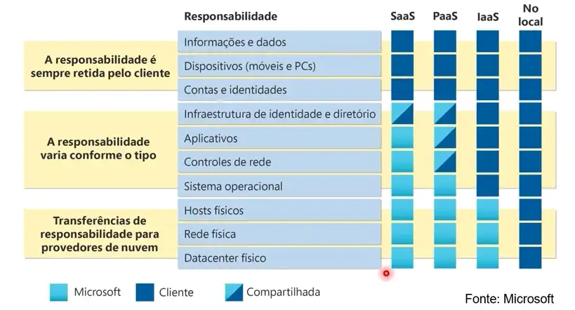

# anotacoes-lab-azure

Esse repositório foi criado na intenção de salvar anotações sobre cloud no read.me e futuramente salvar alguns códigos voltado para cloud computing.

***

## Conceitos de nuvem: Computação 

* A computação em nuvem é o fornecimento de serviços de computação pela internet, habilitando inovações mais rápidas, recursos flexíveis e economias de escala.

* A nuvem (Cloud) é algo parecido com self-service, ou seja você só vai pagar o que usar.

# Modelos de Nuvem 

Atualmente existem 4 modelos de nuvem, sendo esses Nuvem Privada, Nuvem Pública, Nuvem Híbrida e Modelo Multi - Cloud, abaixo iremos comentar sobre esses 4 modelos.

***

## Nuvem Privada 

* A nuvem privada é um ambiente 100% on - premisse, ou seja dentro de sua empresa ou dentro de uma empresa.

* Nesse caso a empresa são totalmente responsáveis por operar os serviços que fornecem.

* E também não fornece acesso aos usuários fora da organização.

## Nuvem Pública 

* A nuvem pública ela pertence a serviços de nuvem (Azure, AWS, GCP e etc) ou provedores de hosting.

* Na nuvem pública é possível fornecer recursos e serviços a várias organizações e usuários.

* Ela é acessada via conexão de rede segura (geralmente pela internet).

## Nuvem Híbrida 

* É a junção da nuvem privada com a nuvem pública, ou seja a empresa tem uma nuvem on premisse e utiliza também nuvem pública.

## Modelo Multi - Cloud 

* Esse modelo Multi - Cloud ele não é citado na prova do AZ900 porém hoje em dia no mercado de trabalho dentro de Big techs é o que mais está sendo utilizado, que é o uso de várias Clouds (AWS, Azure, Oracle, GCP e etc).

# Comparação de Modelos de Nuvem

Uma vez explicado o que tem em cada nuvem, agora iremos mostrar os benefícios que a Nuvem Pública, Nuvem Privada e a Nuvem Híbrida trazem.

***

## Benefícios Nuvem Pública 

* Na nuvem pública você não tem nenhuma despesa de capital (CapEx) para escalar verticalmente.

* Os aplicativos podem ser provisionados e desprovizionados rapidamente.

* E as organizações pagam apneas o que elas utilizam.

## Nuvem Privada 

* Na nuvem privada as organizações têm controle total sobre os recursos e a segurança.

* Além disso as organizações também são responsáveis pela manutenção e pelas atualizações de hardware também.

## Nuvem Híbrida

* Na nuvem híbrida as organizações determinam onde executar seus aplicativos.

* Além disso as organizações controlam a segurança, a conformidade e os requistos legais.

* Por consequência a nuvem híbrida acaba sendo modelo de nuvem que traz mais flexibilidade.

# CapEx e OpEx

* Nesta parte do resumo iremos entrar em termos técnicos como CapEx e OpEx, para entender e poder explicar o que são esses termos futuramente.

## Despesas de Capital (CapEx)

* CapEx é o gasto inicial de dinheiro em infraestrutura física.

* Geralmente podemos identifcar uma despesa CapEx quando o valor se reduz, então sempre que observarmos um valor que está regredindo tem uma possibilidade de ser CapEx.

## Despesas Operacionais (OpEx) 

* OpEx é o gasto com produtos e serviços conforme necessário, pagamento conforme o uso

* E as despesas operacionais são cobradas imediatamente.

# Modelo Baseado em Consumo 

Agora iremos trazer alguns bullets points para entendermos como funciona um modelo baseado em consumo que os serviços de Cloud são baseados.

***

* Os provedores de serviços em nuvem operam em um modelo baseado no consumo, o que significa que os usuários finais pagama somente pelos recursos que usam.

* Com isso temos uma previsão de custo mais otimizada no sentido de 'prever' o quanto a empresa irá gastar no próximo mês ou até mesmo no mês presente.

* Alêm disso são fornecidos preços para recursos e serviços individuais.

* E é sempre bom lembrar que a cobrança é feita com base no seu uso real.

# Benefícios da Nuvem 

Agora entraremos nos benefícios da nuvem por um completo, abordando a alta disponibilidade e escalabilidade, confiabilidade e previsbilidade, a segurança e governança, e a facilidade no gerenciamento e possíveis modificações na nuvem.

***

## Benefícios da Nuvem - Alta Disponibilidade

* A alta disponibilidade da nuvem se da1 pelo fato de que os recursos estão disponiveis sempre que necessário.

* Também temos o SLA (Service-Level-Agreement) que traz a segurança para o contratante sobre disponibilidade da nuvem.

* Mas é importante frisar que quando falamos sobre o SLA da Azure, utilizamos duas métricas para definir o tempo de disponibilidade da nuvem, e elas são Uptime e Downtime, explicarei melhor abaixo:

* Uptime: como já reflete no nome é o tempo que a nuvem estará disponível, pois mesmo que o serviço seja disponibilizado via Internet ele não funciona 100% do tempo visto que existe manutenções, atualizações e etc.

* Downtime: o Downtime é vai ser a responsável por 'balancear' o tempo que a nuvem ficará disponíve, visto que é nessa métrica que é calculado o tempo que a nuvem pode ficar de fora, então se ultrapassar esse cálculo, aí sim teremos a disponibilização do voucher de créditos pela Microsoft.

* Então em resumo, a alta disponibilidade se concentra em garantir a disponibilidade máxima, independente de interrupções, ou eventos que possam ocorrer.

## Benefícios da Nuvem - Escalabilidade:

* A escalabilidade refere-se à capacidade de ajustar recursos para atender à demanda.

* A capacidade de escalar significa que você poderá adicionar mais recursos para lidar melhor com o aumento da demanda.

* Como a nuvem é um modelo baseado em consumo você pagará apenas pelo o que utiliza.

* Então se por exemplo a sua demanda cair, você poderá reduzir seus recursos e assim reduzirá seus custos.

* Com a escala vertical, se você estivesse desenvolvendo um aplicativo e precisasse de mais capacidade de processamento, poderia escalar verticalmente para adicionar mais CPU's ou RAM à máuina virtual.

## Benefícios da Nuvem - Elasticidade:

* Com a elasticidade, se você experimentasse um salto repentino acentuado na demanda, seues recursos implantados poderiam ser expandidos (automaticamente ou manualmente).

* Por exemplo: Você pode adicionar maquinas virtuais ou contêineres por meio da expansão.

* Da mesma forma, se houver uma queda significativa na demanda, os recursos implantados poderão ser reduzidos horizontalmente (de maneira automática ou manual).

## Benefícios da Nuvem - Confiablidade:

* Devido ao design descentralizado, a nuvem naturalmente dá suporte a uma infraestrutura confiável e resiliente.

* Com esse design descentralizado, a nuvem permite que você tenha recursos implantados em várias regiões do mundo.

* Com essa escala global, mesmo que ocorra um evento catastrófico em uma região, as outras regiões ainda estarão em funcionamento.

## Benefícios da Nuvem - Previsibilidade:

* A previsibilidade na nuvem, permite que você avance com confiança, seja no desempenho ou no custo, Ambas são influenciadas pelo Microsoft Azure Well - Architected Framework.

## Benefícios da Nuvem - Segurança: 

* A nuvem vai oferecer ferramentas de segurança que atendem às necessidades dos clientes, mas a implementação dessas ferramentas é de responsabilidade do cliente.

* Se você quiser o controle máximo da segurança, a infraestrutura como serviço fornecerá recursos físicos, mas permitirá que você gerencie os sistemas operacionais e o software instalado, incluindo aplicação de patches e manutenção.

* Se você quiser que a aplicação de patches e a manutenção sejam tratados automaticamente, as implantações de plataforma como serviço (PaaS) ou software como serviço (SaaS) podem ser as melhores estratégias de nuvem para você.

## Benefícios da nuvem - Governança:

* A auditoria baseada em nuvem ajuda a sinalizar qualquer recurso que esteja fora de conformidade com seus padrões corporativos e fornece estratégia de mitigação.

* Dependendo do seu modelo operacional, patches de software e ataulizações também podem ser aplicados automaticamente, o que ajuda na governança e na segurança.

* Ao estabelecer uma presença de governança o mais cedo possível, você podera manter sua presença de nuvem atualizada, protegida e bem gerenciada.

## Benefícios da Nuvem - Gerenciabilidade: 

* Um dos principais benefícios de computação em nuvem são as opçoes de capacidade de gerenciamento. Há dois tipos de capacidade de gerenciamento para computação em nuvem que aprenderemos mais para frente e ambos trazem excelentes benefícios.

* O gerenciamento da nuvem diz respeito a gerenciar seus recursos de nuvem. Por exemplo:

* Escalar automaticamente a implantação de recursos com base na necessidade.

* Implantar recursos com base em modelo pré - cofnigurado, removendo a necessidade de ocnfiguração manual.

* O gerenciamento na nuvem diz respieto a maneira de gerenciar seu ambiente de nuvem e seus recursos. Por exemplo:

* Por meio de um Portal da Web.

* Usando uma interface de linha de comando.

* Usando API's.

* Usando PowerShell.

# Tipos de Serviços de Nuvem na Azure

Nessa parte iremos descrever e entender como cada um dos modelos de serviços se comportam (IaaS, PaaS, SaaS), vamos entender também quais ão nossas responsabilidades e as responsabilidades dos provedores para esses 3 modelos de serviços e identificar o caso de usos apropriados para cada serviço de nuvem (IaaS, PaaS, SaaS)

***

## Infraestrutura como Serviço (IaaS)

* Quando falamos de serviços de nuvem IaaS acaba sendo o serviço mais utilizado.

* É o serviço de nuvem mais flexível, o cliente configura e gerencia o hardware para seu aplicativo.

* No modelo de Infraestrutura como serviço se tem mais acesso no contexto de personalização de recurso, se tendo mais liberdade para trabalhar.

## Plataforma como Serviço (PaaS)

* O modelo PaaS é focado no desenvolvimento de aplicativos

* Em plataforma como serviço um ambiente para criação é ofernecido, o teste e a implantação de aplicativos de software, sem focar no gerenciamento da infraestrutura subjacente.

## Software como Serviço (SaaS)

* O SaaS é smpre focado para o usuário final.

* Os usuários se conectam e usam aplicativos com base em nuvem pela internet: por exemplo, Microsoft Office 365, email e calendários.

# Modelo de Responsabilidade Compartilhada

